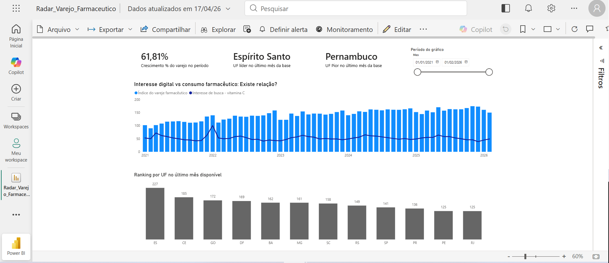

# Avaliar se o interesse digital pode ser utilizado como indicador de demanda no varejo farmacêutico

## Objetivo
Avaliar se o interesse digital pode ser utilizado como indicador de demanda no varejo farmacêutico.

## Dados
- IBGE SIDRA (Tabela 8883 – índice do varejo farmacêutico)
- Google Trends (termo: "vitamina C")

## Ferramentas
- Power BI
- Excel (tratamento de dados)

## Abordagem
Análise temporal comparando a evolução do índice de vendas do varejo farmacêutico com o interesse de busca ao longo do tempo.

## Principais insights
- O varejo farmacêutico apresentou crescimento consistente no período (61,8%).
- O interesse de busca é volátil e apresenta picos pontuais.
- Não há relação consistente entre interesse digital e consumo, sugerindo que a demanda é mais estrutural do que oportunista.

## Dashboard

## Conclusão
O interesse digital não se mostrou um bom indicador isolado de demanda para o varejo farmacêutico, indicando a necessidade de considerar outros fatores na análise de consumo.

## Próximos passos
- Incluir novas variáveis (ex: sazonalidade, clima, campanhas)
- Testar correlação estatística
- Explorar uso de IA para geração de insights
